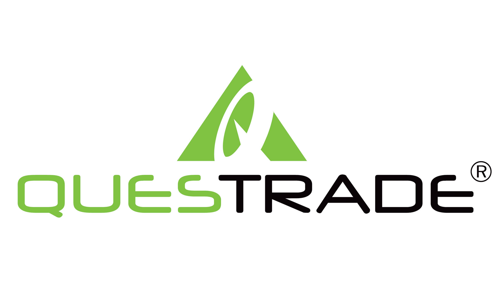
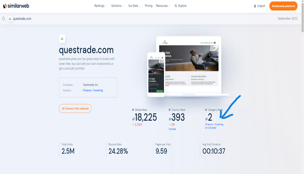

# **Questrade Case study**

## ***Overview of Questrade Financial Group***

Questrade Financial Group is engaged in the business of providing financial products and services to customers across Canada. Its primary business activities include providing deposits, investment, loan, securities, mortgages and other financial products and services to its customers. It was founded by Mr. Edward Kholodenko (current CEO) on October 1, 1999. Questrade is funded by BEST Funds, and this funding round was conducted in 2002. This was a Venture Capital funding round and the funding amount has not been disclosed.    

For the purpose of this case study, the focus shall be on the online brokerage (i.e. discount brokerage) and wealth management business arm of Questrade.  

>***Mr. Edward Kholodenko - Questrade Founder & CEO***
---
---
---

## ***Business Activities of Questrade***
Questrade is an online discount broker and wealth management firm, and its service offerings primarily include ***Self-Directed Investing*** and ***Questwealth Portfolios***. Keeping in line with business practices of an online discount broker, Questrade does not offer any advice to its clients. Instead, Questrade just provides a seamless platform for its clients to trade in the securities markets in real time, while offering very competitive brokerage costs for trading.   

Self-directed investing is a manner in which investors can take control of their own investments as per their own knowledge and understanding of different investment avenues available in the market. Some of the investment avenues available on Questrade are stocks, ETFs, options and mutual funds, etc. This approach is more focused on investors doing their own research and investing as per their personal goals and risk appetite. Furthermore, self-directed investing is clearly very suitable for active investors due to it’s competitive brokerage fees. To serve this segment of self-directed investors better, Questrade provides tools to its clients which include:

•	Real-time news, market insights and research to discover investment ideas; 

•	Investing and trading tools for evaluating and analysing investment choices;
    
•	Investment monitoring to capitalize on market opportunities as they become available with changing market scenarios.

Questwealth Portfolios offers a diversified low-fee portfolio management service to its clients, which is actively managed by a team of experts that constantly keep track of market movements. This service is more ideal for passive investors who do not want the hassle of regularly monitoring the market, and yet want to fulfil their investment objectives.

Some of the features of Questwealth Porfolios service are as follows: 

•	Real-time rebalancing: - the client portfolio is constantly monitored and adjusted with changing market conditions to optimize their returns.

•	Lower taxes: - Portfolio managers utilize the concept of tax-loss harvesting in order to minimize and better manage the capital gains in the clients’ accounts.

•	Proven returns: All the standard portfolios managed by Questrade managers have a strong track record of over 5 years of historical performance. 

•	Reinvested dividends: Dividends earned on investments are automatically reinvested in order to maximise returns through the magic compounding. 

In addition to these features, Questwealth Portfolios also offers the option of Socially Responsible Investing (SRI). As per the SRI concept, Questrade managers not only focus of companies that make profit, but also conduct their business ethically in an environmentally responsible way with strong corporate governance practices. 

In retrospect, any company that acts responsibly and thinks about the community it operates in while conducting its business in a sustainable approach, always develops a good reputation in the eyes of its stakeholders, and strengthens its position in the market. This is exactly what Questrade is attempting to achieve through its Socially Responsible Investing (SRI) initiative. 

Generally speaking, Questrade offers its services to the mass market of both active and passive investors. Nevertheless, the biggest chunk of customers it has are people between the age of 25-34 years. Moreover, 66.44% percent of its customers are male, whilst 33.56% percent are female. In addition, the preferred way of customers to use Questrade’s services is through their desktops.    

According to www.similarweb.com Questrade has a total of 62 technologies from 16 different industries installed on its website to manage its delivery of online brokerage and wealth management services as an online discount broker. Some of these technologies are: Google Adsense, Google Analytics, Facebook Connect, United States Dollar, etc. 

---
---
---
## ***Landscape of Wealth Management industry***
The importance and impact of technology has always been revolutionary on the wealth management industry. However, this argument has found new meaning after the world witnessed life-changing effects of COVID-19 in 2020. 

Clients now not only want bespoke and customized solutions to their investment needs, but they want it in real time. The traditional advisor model has never faced such an intense competition as it does now from Robo-advisors and online discount brokers. Introduction of technology has not only significantly reduced costs, but it has also improved service delivery and accessibility for consumers. The very fabric of retail wealth management sector has significantly been transformed by the rising trend of “Robo-advisory” and “online discount broker” model, which caters perfectly to the tech savvy generation of customers today.  

Even the field of institutional investing is not immune from this explosion of advancing technologies, and emerging business practices to use IT for better performance. In particular, use of data analysis techniques to manage high amounts of data, and leveraging technology to develop deeper market insights for better investment results are gaining popularity amongst many key players in the institutional investment field.

Some of the other players that are in direct competition with Questrade are: CIBC Mellon, Qtrade, RBC Direct Investing, Scotia iTrade, Virtual Brokers, Voleo, Wealthsimple, NestWealth.com, TD Securities etc. 

---
---
---
## ***Results based on Questrade's performance***
Questrade is currently at number 2 position in the online discount brokerage market segment of Canada. Moreover, 15.10% of consumer traffic in Canada lands on Questrade website for their investment solutions. Some of the key factors that make Questrade successful are:

•	68.57% customers that arrive onto Questrade platforms come through direct marketing channels, which goes to show the aggressive and effective marketing practices of Questrade. 

•	Questrade’s presence on social media platforms like Youtube and Facebook is further evidence of pragmatic and efficient use of marketing tools to expand and build on existing customer base. 

•	Its low cost and effective solutions for investment needs of consumers, which the traditional bank-owned brokerages and other market participants find very difficult to compete with. 

•	Its consistency to capture market share and continuously outperform its peers in the industry on all accounts, including customer satisfaction and superior quality of service offerings.

Furthermore, even now Questrade is still one of Canada’s fastest growing online brokers as it has opened over 250,000 new client accounts annually, and has $30 billion of assets under management. Questrade has also been a 10-time winner of Canada’s Best Managed Companies award. This is further evidence of a good corporate governance culture at Questrade, which enables it to attract new talent, retain and expand on its customer base as a result of consumer loyalty, and brandish the company with a stellar reputation in the market and amongst its stakeholders. 

It goes without saying that based on its current business practices, and its ability to induce technology to add value and maximize its performance to deliver investment solutions, Questrade is a force to be reckoned with in the marketplace and amongst its competitors in the online discount brokerage and wealth management industry. 

> ***Questrade's ranking in Canada for investment solutions***

---
---
---
## ***Recommedations for future***
Looking upon the success Questrade has received on retail wealth management, one has to wonder if it can replicate it in offering institutional investment solutions. There is a strong argument to be made in favour of Questrade serving institutional clients. The stellar reputation it has, the history and consistency of its success, and the management’s uncanny ability to effectively delivery investment solutions to its target audience, all work in favour of Questrade’s entry into institutional wealth management sector. Moreover, on the premise of serving institutional investors in Canada, Questrade will be able to take a bigger slice of Canada’s wealth management market, whilst also building up its already impressive competencies of asset management solutions. In fact, such an endeavour into institutional investment field could very well be enough to turn Questrade into a powerhouse in wealth management across North America.   

Nevertheless, in order to serve institutional investors successfully, Questrade would need to introduce entirely different set of solutions, as the requirements in the institutional markets are vastly different from that of retail wealth management. Some of the technologies Questrade should explore are data analytics and machine learning for finance applications. These technologies would go long ways in serving institutional clients for analysing vast amounts of data, and leveraging markets insights for improved investment returns, to name a few.                

---
---
---

### ***References***
[Questrade website](https://www.questrade.com/home)

[Questrade wikipedia page](https://en.wikipedia.org/wiki/Questrade)

[questrade.com Technology Profile](https://en.wikipedia.org/wiki/Questrade)

[crunchbase.com - Questrade page](https://www.crunchbase.com/organization/questrade)

[BNN Bloomberg interview with Questrade CEO](https://www.bnnbloomberg.ca/investing/video/before-you-invest-in-any-asset-class-you-should-do-your-homework-ceo~2447015)

[similarweb - questrade.com](https://www.similarweb.com/website/questrade.com/#overview)

[MoneySense - Questrade's new Robo-advisor service](https://www.moneysense.ca/save/investing/questrade-robo-advisor-questwealth/)

[KPMG - The future of wealth & asset management](https://www.moneysense.ca/save/investing/questrade-robo-advisor-questwealth/)
